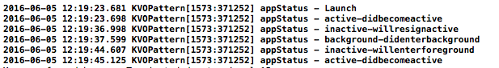

# KVOPattern

在Cocoa Touch框架中，观察者模式的具体应用有两个 -- 通知机制和KVO(Key-Value Observing)机制

其中通知机制,主要包含广播通知（broadcast notification）、本地通知（local notification）、推送通知（push notification)，具体示例请点击[这里](https://github.com/zhuifengshen/ModalViewSample)

KVO机制不像通知机制那样通过一个通知中心通知所有观察者，而是在对象属性变化时通知会被直接发送给观察者对象，具体过程是：属性发送变化的对象需要发出消息给注册观察者addObserver:forKeyPath:options:context，使观察者关注它的某个属性的变化。当对象属性变化时，观察者就会接收到通知，观察者需要重写方法observeValueForKeyPath:ofObject:change:context以响应属性的变化。核心代码如下：

```swift
/// 观察者类
class AppStatusObserver: NSObject {
    /**
     响应属性的变化：NSObject类已实现了NSKeyValueObserving协议
     
     - parameter keyPath: 被关注的属性
     - parameter object:  被关注的对象
     - parameter change:  字典类型，包含了属性变化的内容，这些内容与注册时属性变化设置的选项有关（options参数）
     - parameter context: 注册时传递的上下文内容
     */
    override func observeValueForKeyPath(keyPath: String?, ofObject object: AnyObject?, change: [String : AnyObject]?, context: UnsafeMutablePointer<Void>) {
        NSLog("%@ - %@", (keyPath! as NSString), (change![NSKeyValueChangeNewKey] as! NSString))
    }
}
```

```swift
        ///观察属性appStatus
        //dynamic表示该属性是在运行时动态派发的
        dynamic var appStatus: NSString!
        //定义观察者
        var observer: AppStatusObserver!
        
        self.observer = AppStatusObserver()
        /**
         注册通知：告诉观察者（AppStatusObserver)开始观察AppDelegate的appStatus属性变化
         - parameter addObserver: 观察者
         - parameter forKeyPath: 被关注对象的属性
         - parameter options:    属性变化设置的选项，本例中New和Old表示把属性新旧两个值都传递给观察者，这些值是NSKeyValueObservingOptions类型的成员
         - parameter context:    上下文内容，它的类型是C语言形式的任何指针类型，Swift：UnsafeMutablePointer<Void>,Objective-C:void *
         */
        self.addObserver(self.observer, forKeyPath: "appStatus", options: [.New, .Old], context: nil)
        self.appStatus = "Launch"
```

示例中输出属性appStatus的情况，运行输出如下：


如果喜欢的话，欢迎**Star**一下
